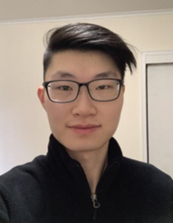

# Web Server Programming 2023
A Github repo for a class taken at my University
## Who am I?

I am a Computer Engineering student in his Junior year. Computer science courses I have taken so far are CS1, CS2, Software Engineering, and C/C++ in SUNY New Paltz. In Software Engineering, I have worked in a team of 7 people to create a video game using Unreal Engine and C++. With C/C++ and Arduino, I have created a traffic light system. I have also learnt HTML/CSS and JavaScript on my own and created static webpages with simple games like Blackjack, Snake, and a template portfolio website. I am currently working on a chat application using Socket.io. 

After this course, I look forward to developing a strong foundation in full-stack development where I can make more complex and practical projects, as well as be exposed to a variety of new topics that can be more easily built on. I find that the hardest part of learning any subject in Computer Science is the initial exposure to new technologies. Once a simple structure of understanding is built in the mind, it is easy to build on top of it. As a result, I hope that this class will open a new socket inside my mind.

